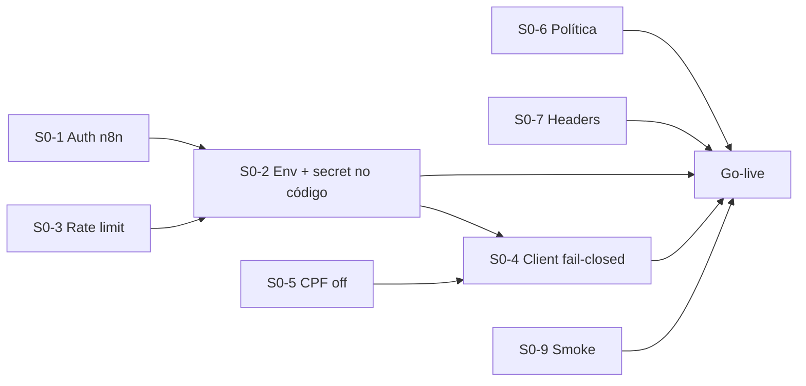

# Plano de resolução — Segurança & LGPD (EvoFit Site)

**Formato:** Scrum Master · **Priorização:** 80/20 · **Técnicas:** Premortem + loop de endurecimento  
**Escopo:** landing `evofit-site` + pipeline de lead (`/api/lead` → n8n)  
**Fora de escopo (neste plano):** painel admin, catraca, banco de alunos  
**Data:** 2026-07-24 · **Versão:** 2.0 (revisada)

---

## 1. Objetivo e Definition of Done

### Objetivo (1 frase)
Fechar as falhas que **realmente expõem dados pessoais ou poluem a operação**, antes (ou no momento) do go-live da landing, sem engessar o time com work de cauda longa.

### Definition of Done (mensurável)

| # | Critério | Como provar |
|---|----------|-------------|
| D1 | Webhook n8n **não aceita** POST anônimo | `curl` sem secret → 401/403 |
| D2 | Secret **só** em env server-side; zero URL/secret no git | `git grep` limpo + env Vercel |
| D3 | `/api/lead` com **rate limit** + validação de Origin | 20 req/min do mesmo IP → 429 |
| D4 | Cliente **só** abre WhatsApp se API retornou sucesso real | teste manual + unit |
| D5 | Política de privacidade **honesta** (Analytics, retenção, canal de direitos) | diff da página |
| D6 | Headers de segurança mínimos no deploy | curl headers |
| D7 | CPF fora da landing **ou** consentimento auditável | decisão explícita + código |
| D8 | Dependências high do `npm audit` resolvidas ou aceitas com risk note | audit limpo ou ADR |

**Go-live gate:** D1–D6 obrigatórios. D7–D8 no mesmo sprint se couber; senão Sprint+1 com risk accepted documentado.

---

## 2. Regra 80/20 — o que move o risco

### Os 20% de esforço que matam ~80% do risco

| Ordem | Item | Risco que fecha | Esforço |
|------:|------|-----------------|---------|
| 1 | Auth no webhook n8n + rotacionar URL | Injeção de leads / pipeline aberto | S |
| 2 | Secret só em env; remover hardcoded | Exposição permanente no git | S |
| 3 | Rate limit + Origin no `/api/lead` | Flood, spam, abuso | S–M |
| 4 | Fail-closed no client (respeitar `res.ok`) | Falso sucesso + base vazia | S |
| 5 | Política: Analytics + e-mail real + retenção | Transparência LGPD / art. 6º | S |
| 6 | Headers de segurança no Next/Vercel | Baseline web hygiene | S |
| 7 | Decisão CPF: **remover** (default 80/20) | Minimização + superfície legal | S |

### Os 80% de esforço que deixamos de fora do Sprint 0 (backlog consciente)

| Item | Por que não é Sprint 0 | Quando |
|------|------------------------|--------|
| Turnstile/hCaptcha | Rate limit cobre 80% do abuse; captcha é refinamento UX | Sprint 1 se abuse real |
| ROPA formal + LIA jurídica | Governança; não fecha buraco técnico aberto | Sprint 1–2 c/ jurídico |
| DPO nomeado em contrato | Compliance org, não código | Sprint 1 c/ legal |
| Monitoramento Sentry/Slack webhook | Operacional; D4 já evita mentir pro user | Sprint 1 |
| Termos de uso | Não é vetor de vazamento atual | Sprint 2 |
| CSP rígida com nonce | Headers base já ajudam; CSP full quebra analytics | Sprint 1 com cuidado |
| Painel admin / 2FA produto | Fora de escopo deste repo | Outro programa |
| Auditoria forense do n8n completo | Precisa acesso n8n; P0 é fechar a porta | Após P0, ops |

**Princípio:** se não está na tabela dos 7, **não entra no Sprint 0** sem desempate do Product Owner.

---

## 3. Premortem — “É 2026-08-15. O plano falhou. Por quê?”

> Exercício: assumir fracasso e listar causas **antes** de executar. Cada causa vira mitigação ou kill-switch.

| # | Causa do fracasso (premortem) | Prob. | Impacto | Mitigação no plano |
|---|--------------------------------|:-----:|:-------:|--------------------|
| P1 | Deploy da landing **sem** secret no n8n (env esquecida) | Alta | Crítico | Checklist go-live + smoke `curl` D1 pós-deploy |
| P2 | Secret commitado “só por um momento” e nunca rotacionado | Média | Crítico | Proibir default no código; só `process.env` sem fallback de URL pública |
| P3 | Rate limit só no Next, atacante bate **direto no n8n** | Alta | Alto | Auth no n8n é **pré-requisito** de qualquer deploy; rate limit é defesa em profundidade |
| P4 | Time remove URL hardcoded mas deixa path antigo vivo no n8n | Média | Alto | Desativar workflow antigo no mesmo PR/ops |
| P5 | “Remover CPF” vira discussão e **nada sobe** | Alta | Médio | Default 80/20: **remover**. Reintroduzir só com checkbox + log (story separada) |
| P6 | Política reescrita, Analytics continua sem menção | Média | Médio | DoD D5 com checklist de 3 bullets obrigatórios |
| P7 | DNS apex/www ainda no painel → landing “pronta” mas invisível | Alta | Alto | Story de DNS no Sprint 0 ou blocker explícito de go-live |
| P8 | `ok: true` fail-open permanece “por conversão” | Alta | Médio | DoD D4; review rejeita fail-open sem feature flag documentada |
| P9 | `npm audit fix` quebra build e rollback sem patch de segurança | Média | Médio | Patch em branch isolada; se quebrar, pin + risk note, não ignore silencioso |
| P10 | Premortem virar documento e **ops não limpar** leads de teste | Média | Baixo | Task ops 15 min no Sprint 0 Day 1 |
| P11 | Parallel agents editam o mesmo arquivo e geram conflito | Média | Médio | Ownership por arquivo (matriz abaixo) |
| P12 | Escopo creep: “já que estamos nisso, refatora o modal” | Alta | Médio | Definition of Ready + WIP limit 1 epic técnico por dev |

### Kill-switch (quando abortar go-live)

Abortar ou reverter se **qualquer** for verdade:
1. Webhook ainda responde 200 sem secret  
2. CPF ou e-mail de lead indo para URL sem TLS  
3. Landing pública com política apontando para `noreply@` sem caixa monitorada  

---

## 4. Visão Scrum Master

### Papéis

| Papel | Quem (ajustar nomes) | Responsabilidade |
|-------|----------------------|------------------|
| Product Owner | Dono produto / Tiago | Prioridade 80/20, aceita D7 (CPF), go/no-go |
| Scrum Master | Coordenador deste plano | Impedimentos, WIP, gates, sync de agents |
| Dev A — API/Security | Agent/dev | `/api/lead`, headers, rate limit |
| Dev B — Front/LGPD UX | Agent/dev | Modal, política, remoção CPF |
| Dev C — Ops/n8n | Ops + agent se tiver acesso | Secret n8n, rotacionar URL, limpar testes |
| Dev D — Platform | Agent/dev | DNS/deploy notes, deps, smoke scripts |
| Reviewer | Agent review | Diff vs DoD, anti-regressão fail-open |

### Cadência sugerida (Sprint 0 — **3 dias úteis**)

| Dia | Foco | Cerimônia |
|-----|------|-----------|
| D0 | Kickoff + decisões (CPF off, secret scheme) | Planning 30 min |
| D1 | Wave 1 paralela (auth n8n + API + política base) | Standup 10 min |
| D2 | Wave 2 (client fail-closed, headers, deps, DNS note) | Standup + mid review |
| D3 | Integração, smoke DoD, go/no-go | Review + retro 20 min |

### WIP limits
- Máx. **3 stories In Progress** humanas  
- Máx. **4 agents em paralelo** por wave (ownership de arquivo sem overlap)

---

## 5. Backlog priorizado (Product Backlog → Sprint 0)

### Epic E0 — Fechar a porta de dados (80% do valor)

| ID | Story | Pontos | Owner | Deps | DoD link |
|----|-------|:------:|-------|------|----------|
| **S0-1** | n8n: Header Auth (`X-Lead-Secret`) + desativar path antigo | 2 | Ops C | — | D1 |
| **S0-2** | Código: `LEAD_WEBHOOK_URL` + `LEAD_WEBHOOK_SECRET` sem fallback público | 2 | Dev A | S0-1 (secret definido) | D2 |
| **S0-3** | Rate limit IP (ex. 10/min) + checagem Origin allowlist | 3 | Dev A | — | D3 |
| **S0-4** | Client: só WhatsApp se `res.ok`; mostrar erro se webhook falhar | 2 | Dev B | S0-2 contract | D4 |
| **S0-5** | Remover campo CPF/CNPJ do modal + API (default 80/20) | 2 | Dev B | PO confirm | D7 |
| **S0-6** | Política: Analytics, retenção 12m, `privacidade@…`, sem “sem cookies de terceiros” falso | 2 | Dev B | — | D5 |
| **S0-7** | Headers: HSTS, nosniff, frame-ancestors, referrer, permissions; `poweredByHeader: false` | 2 | Dev A | — | D6 |
| **S0-8** | Ops: apagar leads de teste auditoria no n8n/CRM | 1 | Ops C | — | hygiene |
| **S0-9** | Smoke script `scripts/security-smoke.sh` (D1–D6) no README | 2 | Dev D | S0-1..7 | gate |
| **S0-10** | `npm audit` / upgrade Next patch | 2 | Dev D | — | D8 |
| **S0-11** | Checklist DNS apex=landing / www=painel (ou doc do estado real) | 1 | Dev D | PO | P7 |

**Sprint 0 capacity alvo:** ~21 pts (cabe em 3 dias com 2–3 executores + ops).

### Epic E1 — Cauda 20% (Sprint 1, só se P0 verde)

| ID | Story | Por quê depois |
|----|-------|----------------|
| S1-1 | Turnstile no modal | Abuse residual |
| S1-2 | Log estruturado + alerta Slack se n8n ≠ 2xx | Observabilidade |
| S1-3 | Consent log se reintroduzir documento | LGPD avançada |
| S1-4 | CSP report-only → enforce | Hardening |
| S1-5 | ROPA one-pager + LIA | Jurídico |
| S1-6 | Termos de uso | Legal package |

---

## 6. Execução com máximo paralelismo (waves de agents)

### Matriz de ownership (anti-conflito)

| Path | Owner exclusivo Wave 1 | Wave 2 |
|------|------------------------|--------|
| n8n (fora do repo) | Ops C | — |
| `app/api/lead/route.ts` | **Dev A** | Dev A |
| `next.config.ts` / `vercel.json` | **Dev A** | — |
| `components/lead/lead-modal.tsx` | **Dev B** | Dev B |
| `app/politica-de-privacidade/page.tsx` | **Dev B** | — |
| `lib/documento.ts` | Dev B (delete usage / keep util se ainda útil) | — |
| `package.json` / lock | **Dev D** | — |
| `scripts/security-smoke.sh` + README | **Dev D** | — |
| `docs/*` | Scrum Master | — |

### Wave 1 — t=0 (4 trilhas em paralelo)

```
[Ops C]  S0-1 secret n8n + rotacionar URL + S0-8 limpar testes
[Dev A]  S0-2 contract env (aguardando secret) + S0-3 rate limit skeleton + S0-7 headers
[Dev B]  S0-5 remover CPF + S0-6 política (paralelo, arquivos distintos)
[Dev D]  S0-10 audit deps + S0-11 DNS note (sem tocar API/modal)
```

**Gate W1→W2:** Ops C entrega `LEAD_WEBHOOK_URL` + `LEAD_WEBHOOK_SECRET` no cofre/Vercel (não no chat).

### Wave 2 — após gate W1

```
[Dev A]  S0-2 ligar secret no fetch + fail real se n8n falhar (opção A: 502)
[Dev B]  S0-4 client fail-closed alinhado ao contrato API
[Dev D]  S0-9 smoke script apontando prod/preview
[Review] Diff checklist DoD D1–D7
```

### Wave 3 — integração (1 owner de merge)

```
[Integrator] merge ordenado: headers → api → modal → política → scripts
[All]        smoke D1–D6 em preview Vercel
[PO]         go / no-go
```

### Contratos entre agents (interface estável)

**Request** `POST /api/lead`
```json
{ "nome": "string", "telefone": "string", "email": "string", "origem": "string?" }
```
Sem `documento`.  

**Response**
- `200 { "ok": true }` só se n8n 2xx  
- `400 { "ok": false, "error": "invalid_*" }`  
- `429 { "ok": false, "error": "rate_limited" }`  
- `502 { "ok": false, "error": "upstream_failed" }`  

**Headers outbound n8n**
```
Content-Type: application/json
X-Lead-Secret: <LEAD_WEBHOOK_SECRET>
```

---

## 7. Sequência crítica (ainda que work seja paralelo)



**Caminho crítico real:** S0-1 → S0-2 → S0-4 → smoke → go-live.  
Tudo o mais é paralelo ao caminho crítico.

---

## 8. Checklist de go-live (imprimir)

- [ ] `LEAD_WEBHOOK_URL` e `LEAD_WEBHOOK_SECRET` na Vercel (Production + Preview)
- [ ] n8n exige secret; path antigo desligado
- [ ] `curl` sem secret → falha
- [ ] `curl` com secret + payload válido → 200 e registro
- [ ] 15 POSTs rápidos → rate limit
- [ ] Modal sem CPF; política atualizada
- [ ] Headers presentes no response
- [ ] Preview smoke script verde
- [ ] DNS/decision documentada (apex vs www)
- [ ] Leads de teste da auditoria apagados
- [ ] PO assina go-live

---

## 9. Riscos residuais aceitos (explícitos)

| Risco residual | Por que aceitar no Sprint 0 | Revisão |
|----------------|----------------------------|---------|
| Sem captcha | Rate limit + secret bastam no volume atual | 30 dias pós-go-live |
| Sem ROPA formal | Não fecha vazamento técnico | Sprint 1 jurídico |
| CSP permissiva | Evita quebrar Analytics no dia 1 | Sprint 1 |
| WhatsApp como subprocessador | Já declarado; fluxo de negócio | Melhorar texto S0-6 |

---

## 10. Métricas de sucesso (pós-entrega)

| Métrica | Baseline | Alvo 14 dias |
|---------|----------|--------------|
| POSTs anônimos no n8n | 200 abertos | 0 |
| Taxa de lead “fantasma” (WhatsApp sem registro) | desconhecida | < 2% |
| 429 em prod | 0 | só em abuse |
| Incidente LGPD aberto | 0 | 0 |
| Tempo médio smoke security | n/a | < 2 min |

---

## 11. Loop de endurecimento do plano (transparência)

### Rubrica (pesos)

| Critério | Peso | O que é “alto” |
|----------|:----:|----------------|
| Foco 80/20 / anti-escopo | 20 | 7 itens ou menos no crítico |
| Sequência & deps | 15 | Caminho crítico claro |
| Premortem acionável | 15 | Cada causa → mitigação |
| Paralelismo realista | 15 | Ownership sem colisão de arquivo |
| Mensurabilidade DoD | 15 | Critérios testáveis |
| Viabilidade 3 dias | 10 | Pontos cabem |
| Riscos residuais honestos | 10 | Aceites explícitos |

### Trajetória

| Round | Score | O que mudou |
|------:|------:|-------------|
| R0 rascunho audit→tasks | 68 | Lista longa, pouco corte |
| R1 Scrum + waves | 78 | Paralelismo, mas ainda “tudo é P0” |
| R2 **80/20 brutal** | 86 | 7 itens Sprint 0; resto E1 |
| R3 + **premortem** | 91 | Kill-switch, P1–P12, anti fail-open |
| R4 revisão final (este doc) | **93** | Contratos API, matriz arquivos, go-live checklist |

**Plateau:** +2 margem; R4 vs R3 = +2 (aceito). Best-of-N estrutural não superou o frame “Sprint 0 de 3 dias + E1 cauda”.

### Maiores ganhos do loop
1. Corte explícito do que **não** fazer no Sprint 0  
2. Premortem transformado em gates e kill-switches  
3. Contrato estável entre agents (payload/response) para paralelismo sem retrabalho  

---

## 12. Primeira ação (agora)

1. **PO (5 min):** confirmar **CPF off** na landing (recomendado).  
2. **Ops C (30 min):** criar secret n8n + novos env names.  
3. **Kickoff Wave 1** com 4 owners da matriz.

Sem o passo 1–2, agents de código ficam bloqueados ou inventam secret — **não iniciar Wave 1 de código sem S0-1 definido**.

---

## Apêndice A — Mapeamento auditoria → story

| Achado auditoria | Story |
|------------------|-------|
| Webhook aberto 200 | S0-1, S0-2 |
| Sem rate limit | S0-3 |
| Fail-open ok:true | S0-2, S0-4 |
| CPF / minimização | S0-5 |
| Política vs Analytics / noreply | S0-6 |
| Sem security headers | S0-7 |
| npm audit high | S0-10 |
| DNS apex/www | S0-11 |
| Leads teste auditoria | S0-8 |
| Captcha, ROPA, CSP full, Sentry | E1 |

## Apêndice B — Fora de escopo (não negociar no Sprint 0)

- Refator visual do modal  
- Novo design system  
- Integração CRM além do n8n  
- Segurança do painel `www`  
- Migração de provider de e-mail  
- Reescrever copy de marketing (exceto menções falsas de privacidade)

---

*Documento vivo. Atualizar score de riscos após go-live e na retro do Sprint 0.*
